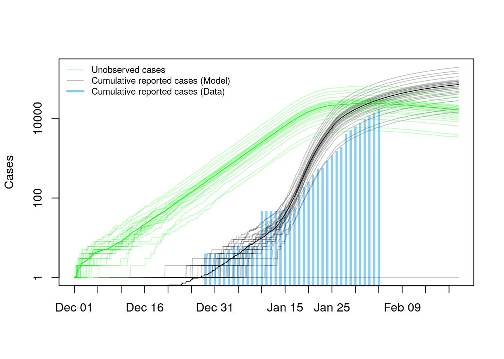
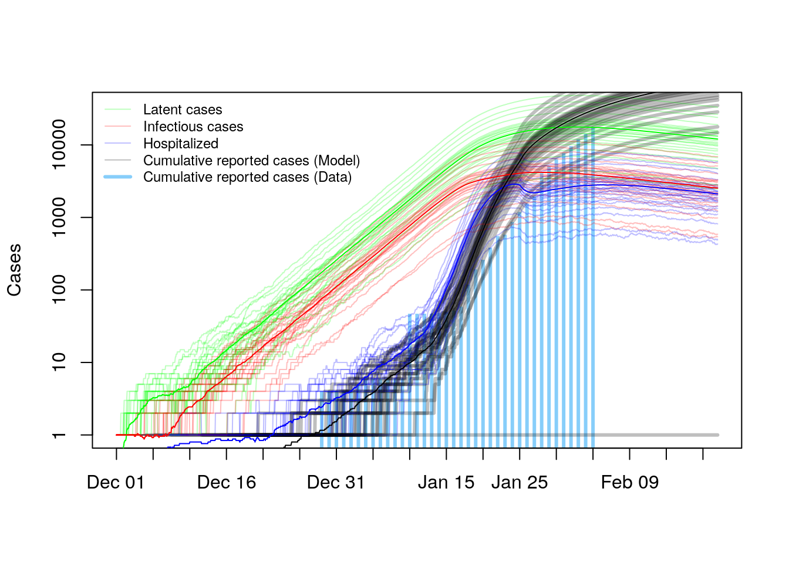
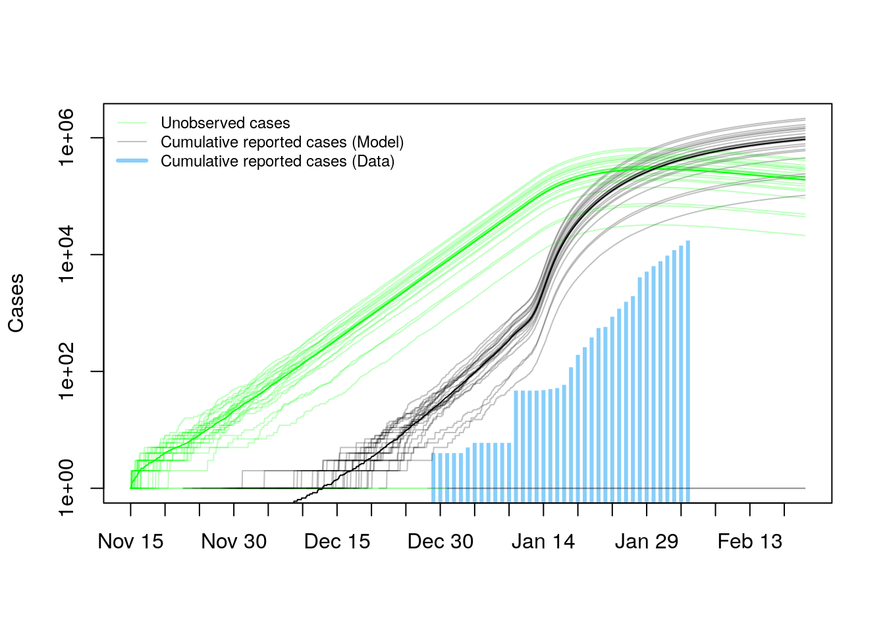
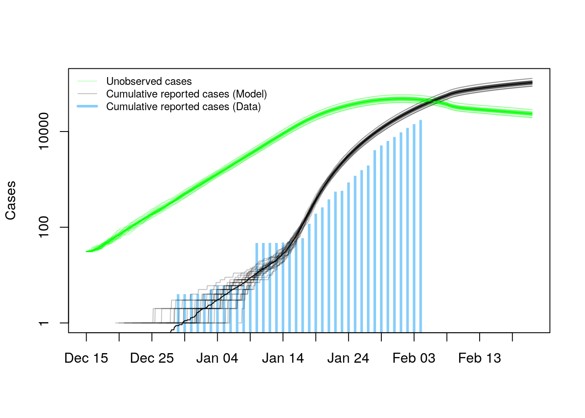
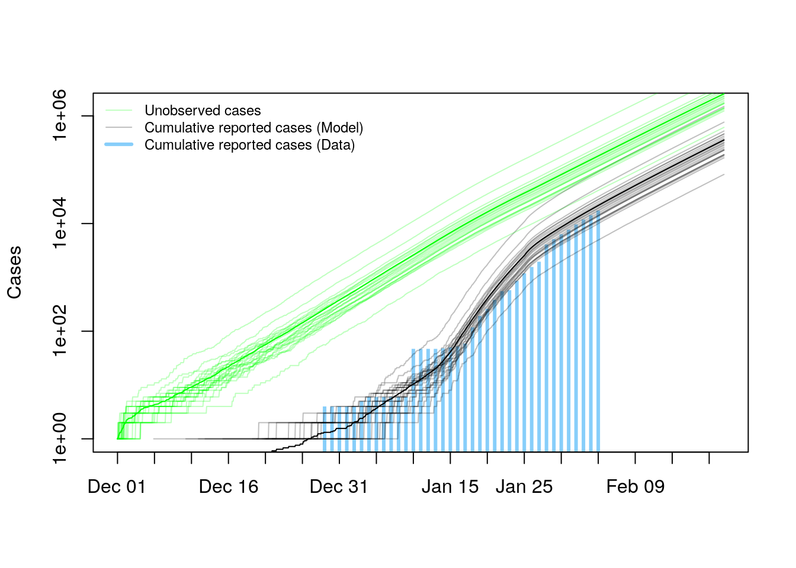

```{r setup, include=FALSE}
knitr::opts_chunk$set(echo = TRUE)
```

## Introduction

We developed a stochastic model to better understand the transmission of 2019-nCov in Hubei (primarily Wuhan).
The model includes several features of the Wuhan outbreak that are absent from most compartmental models that otherwise confound the interpretation of data, including time-varying rates of case detection, patient isolation, and case notification.
We are investigating the plausibility of alternative scenarios for the early phase of the epidemic, by modifying initial conditions and the time-dependence of these key properties.
By forward simulation, the model enables the generation of predictions about the future trajectory of the epidemic under alternative scenarios for containment.
This model is calibrated using a variety of data sets, including the [Oxford Line List](https://docs.google.com/spreadsheets/d/1itaohdPiAeniCXNlntNztZ_oRvjh0HsGuJXUJWET008/edit#gid=0) and [BNO News Reports](https://bnonews.com/index.php/2020/02/the-latest-coronavirus-cases/).
This model was parameterized using clinical outcome reports and has not been calibrated by fitting to case notification data.
All findings are preliminary and subject to change, pending future changes in the underlying data.
These results have not been peer-reviewed, but have been prepared to a professional standard with the intention of providing useful information about a rapidly developing event. 

## Model

The model supposes every individual in the population may be classified according to one of four mutually exclusive segments:

1. Susceptible ($S$)
2. Latent infection ($E$)
3. Infectious case in the community ($I$)
4. Hospitalized ($H$)
5. Discharged ($R$)

All infectious cases are either detected ($I_d$) or undetected ($I_u$) according to a time-varying case detection rate ($0 \leq q(t) \leq 1$).
The linear chain trick is used to model realistic distributions for the progression from (i) latent to infectious infection, and (ii) infectious circulating in the community to isolation.

The rate of progression from symptomatic illness to hospitalization ($\gamma(t)$) is assumed to be piecewide linear with an average infectious period of $\frac{1}{0.143}\approx 7$ days prior to intervention day $d$, followed by a linear increase in average recovery rate at rate $a_0$. The default assumption is that $d=45$, which (assuming an epidemic start date of December 1) corresponds to a signficant change on January 15 as found by statistical analysis, and four days before testing was expanded in Wuhan.

\begin{equation}
  \gamma(t) = 
  \begin{cases}
      \frac{1}{7}, & \text{if } t < d\\
      \frac{1}{7}+ a_0(t-d),   & \text{otherwise}
  \end{cases}
\end{equation}

Case detection rate, $q(t)$, is also assumed to be time-dependent.
We assume that case detection was initially rare at rate $q_0$, but at time $w$ becomes higher, for instance after the opening of fever clinics on 9 January or the expansion of testing on 19 January.

\begin{equation}
  q(t) = 
  \begin{cases}
      q_0, & \text{if } t \leq w\\
      q_1,                   & \text{otherwise}.
  \end{cases}
\end{equation}

The model also tracks case notifications.
The time of case notification is assumed not to affect the ensuing epidemic dynamics, but tracking case notifications faciliates a comparison with data.

Notification is also assumed to be time dependent, consistent with statistical analysis of data from the line list.
Analysis of clinical outcomes suggests that the *notification rate* may be represented by

\begin{equation}
  \eta(t) = 
  \begin{cases}
      (-0.47t+27.2)^{-1}, & \text{if } t \leq 55\\
      1,                   & \text{otherwise}.
  \end{cases}
\end{equation}


The epidemic is assumed to have originated on December 1, 2019 with one case, consistent with [evidence from molecular evolution](https://nextstrain.org/ncov) and preliminary outbreak investigations.
Although the majority of early transmission was in Wuhan, the infection quickly spread to the surrounding area and the model is intended to reflect the state of the epidemic in the entire province of Hubei.

Other key parameters of the model include:

*  Population size of Hubei: $N \approx 59,002,000$ (Wikipedia)
*  Basic reproduction number in Hubei: $R_0=4.6$
* Natural infectious period ($1/\gamma_0$): 7 days
* Transmissibility: $R_0 \times \gamma_0 \approx 0.657$
* Rate of increase in isolation rate: $a_0=0.0446$
* Time at which case detection rate increased: January 9, 2020 (Day 40)
* Time at which increase in isolation rate initiated: January 15, 2020 (Day 45)

## Scenarios

Initially, we have considered the following four scenarios.
Case notification data for Hubei are plotted for comparison.

### Scenario 1. Baseline scenario

We consider Scenario 1 to be our most likely scenario.
In this scenario, the outbreak starts from one case around December 1.
The plot below shows the total unreported size of the epidemic (green) compared with both model generated (grey) and observed (blue) case notifications for 25 realizations of the model.
This model captures reasonably well the early growth in case notifications from 29 December to 15 January.
It also accounts for the relatively large number of cases in early January, that were then unknown but now well understood from calculations based on import frequencies to have been in the thousands to tens of thousands.
The model also shows an increase in case notifications coinciding with greater case detection.
The increase in case detection in the model also leads to an increase in the rate of isolation, which is reflected in a peak in unobserved cases in late January.
A discrepancy between this model and the data is the relatively larger number of notifications predicted by the model.
One possible explanation for this discrepancy is that case notifications are not in fact occurring as quickly as predicted by the model. 
Indeed, our case notification rate sub-model holds that after January 25 case notifications have on average occured within one day of detection, which seems exceptionally fast.
Although this sub-model is derived statistically from data, information is actually quite limited about the case notification rate in Hubei after January 25, so that the model is highly dependent on information from elsewhere.
It is quite plausible that the high burden of cases in Hubei is causing case notification to lag there more than in other regions affected by the outbreak.



Another plot illustrates the trajectory of the epidemic in greater detail.
Here, cases are distinguished by inefction status and the importance of the lag between latent and infectious cases is apparent.



### Scenario 2: Earlier spillover event

For comparison, we also show the results of an outbreak starting from one case around November 15.
This scenario was prompted by initial reports that the time to most recent common ancestor was "mid-November" and recognition (from the fequency of imported cases elsewhere) that the outbreak was already quite large by mid-January.
This model shows a large discrepancy between predicted and observed cases, supporting the later date of emergence envisioned in Scenario 1.



### Scenario 3: Multiple simultaneous exposures

A third scenario considers an outbreak originating from 15 cases around December 15. This scenario is prompted by the report that the initial cluster was associated with the Huanan Seafood market and represents the possibility of multiple exposures in a single spillover event.
The relative lack of spread among these trajectories reflects the larger size of the outbreak at its origin, not greater confidence in the projection.
This model fits the early phase of the outbreak well and does more poorly after January 28, similar to Scenario 1



### Scenario 4: Ineffectiveness of containment

For contrast, a fourth scenario supposes a mass exposure in the seafood market and (hypothetically) that interventions have had no effect on the isolation rate.
This scenario is not considered to be epidemiologically plausible because inconsistent with known actions and line list data, but is included here for comparion.
As for Scenario 1 and Scenario 3, the model-predicted expected case notification curve is reasonably consistent with the observed data through the first three weeks of January.




## Discussion

These scenarios suggest that a early emergence data is relatively less likely compared with the conditions of Scenarios 1, 3, and 4.
The comparable fits of Scenarios 1, 3, and 4 suggest that the series of case notifications available at this time does not contain the information needed to draw conclusions about the conditions originating the outbreak and effectiveness of interventions.
We nonetheless consider our baseline scenario (Scenario 1) to most closely reflect the actual trajectory of the epidemic in Wuhan and Hubei because of its consistency with other sources of information (specifically, information about the progression of cases in the Oxford line list and calculations about the number of unonbserved cases based on infections exported to elsewhere).

## Details

Additional details available online at https://github.com/CEIDatUGA/ncov-wuhan-stochastic-model.